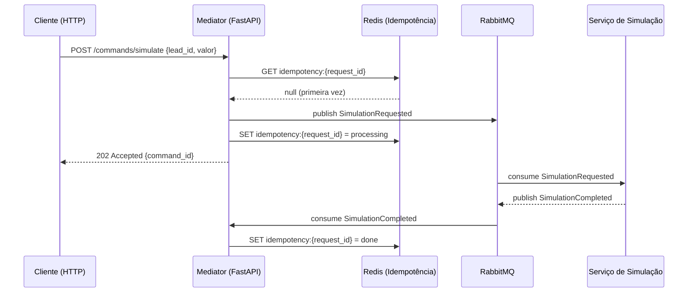
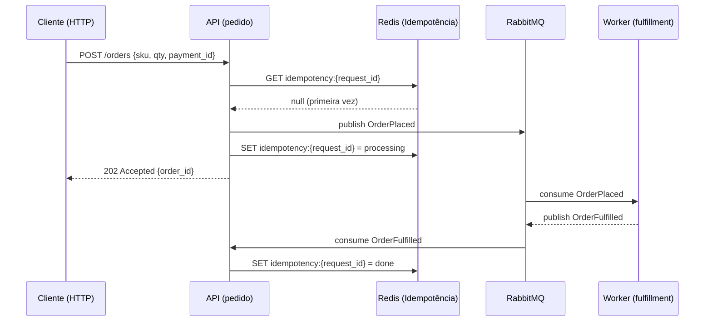

# TUTORIAL-FORMAT — Contrato de Formato dos Arquivos learn/

## Estilo de escrita: prosa, não tópicos

O tutorial é escrito inteiramente em parágrafos com frases completas. Não use listas com marcadores (•, -, *) nem listas numeradas para explicar conceitos ou guiar passos — use prosa corrida. A única exceção são blocos de código, comandos a executar e exemplos de arquivos de configuração, que ficam em fenced code blocks com a linguagem especificada.

Escreva como se estivesse explicando em voz alta para um desenvolvedor júnior inteligente: sem condescendência, sem abreviar a explicação, sem pular etapas "por serem óbvias". Todo parágrafo tem uma função — ou explica um conceito, ou justifica uma decisão, ou prepara o usuário para o que vem a seguir.

**Bom:** "O arquivo `.gitignore` precisa existir antes do primeiro commit porque o git começa a rastrear um arquivo no momento em que ele aparece pela primeira vez num commit. Se você colocar um arquivo sensível num commit e depois adicioná-lo ao `.gitignore`, o git para de monitorar mudanças nele, mas ele permanece no histórico para sempre — qualquer pessoa com acesso ao repositório pode recuperar o conteúdo daquele commit."

**Ruim:** "Crie o `.gitignore` antes do primeiro commit para não rastrear arquivos desnecessários."

## Estrutura de cada arquivo de tutorial

Todo arquivo `learn/XX-nome.md` começa com um parágrafo de contexto que situa o leitor: o que foi feito até aqui, por que este passo importa para o projeto e o que vai ser construído nesta seção. Depois vem o conteúdo em ordem sequencial. O arquivo termina com um parágrafo de verificação que descreve o estado esperado do repositório ao final do passo, com os comandos exatos que o usuário deve rodar para confirmar que tudo funcionou, e o output esperado de cada um.

## O porquê de cada item

Cada ferramenta, configuração, flag de comando ou padrão adotado deve ser acompanhado de uma justificativa em prosa imediatamente após sua introdução. Não diga apenas "instale o X". Diga por que o X é a escolha profissional neste contexto, o que ele resolve, qual alternativa existe e por que foi descartada, e o que aconteceria sem ele no longo prazo. Essa justificativa é o diferencial do tutorial em relação a um README de instalação.

## Blocos de código

Use fenced code blocks com a linguagem correta — `bash`, `python`, `toml`, `yaml`, `dockerfile`, `json`, `ini`, `makefile`, etc. Quando o bloco é um arquivo a ser criado, indique o path relativo ao repositório em texto antes do bloco, assim: "Crie o arquivo `pyproject.toml` na raiz do projeto com o seguinte conteúdo:". Quando é um comando a executar no terminal, indique se há algum pré-requisito de diretório — por exemplo, "dentro da pasta do projeto, execute:".

Nunca coloque um bloco de código sem explicar o que ele faz antes ou depois. O código é o artefato; o texto em volta é o aprendizado.

## Diagramas

Quando a arquitetura ou o fluxo de dados merecerem visualização, use Mermaid dentro de fenced code blocks marcados como `mermaid`. Prefira `sequenceDiagram` para mostrar chamadas entre serviços em sequência de tempo, e `flowchart TD` para estrutura de componentes, estados de uma máquina de estados ou árvore de decisão. O diagrama deve vir antes do código que implementa o que ele ilustra — o leitor precisa entender o design antes de ver a implementação.

Exemplo de diagrama de sequência para o fluxo lead → simulação em um serviço de financiamento:

Exemplo equivalente em domínio de e-commerce (mesmo padrão: API → idempotência → fila → worker):

Use o domínio do projeto do usuário nos nomes de participantes, rotas e eventos — os diagramas acima são só moldes de estrutura, não conteúdo a copiar literalmente.

## Tom e pessoa

Escreva na segunda pessoa do singular: "você vai criar", "rode este comando", "observe que". Não use o imperativo distante ("deve-se criar", "é necessário que"). Não use gírias. Seja direto sem ser seco — há espaço para curiosidades, pegadinhas comuns e explicações de por que algo funciona daquele jeito, e essas adições fazem a diferença entre um tutorial que se lê e um que se abandona.

## Tamanho e ritmo

Um arquivo de tutorial deve cobrir um passo lógico completo do projeto — nem mais, nem menos. Se o passo for grande (como configurar todo o ambiente de desenvolvimento), o arquivo pode ser longo. Não divida artificialmente em arquivos menores só para parecer mais organizado. Divida quando o assunto mudar de verdade: ambiente é um arquivo, estrutura de código é outro, primeira rota é outro.
